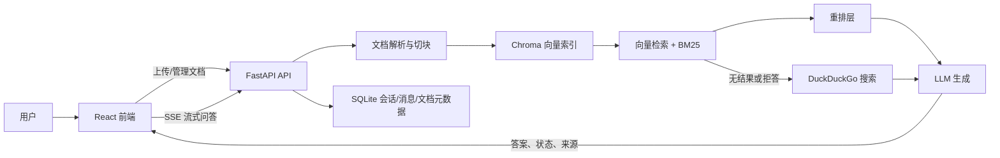

# RAG 项目前后端学习、改进与功能拓展指南

> 梳理日期：2026-07-16  
> 梳理范围：`frontend/`、`backend/`、测试与评测脚本、Docker/Nginx、Jenkins/GitHub Actions、现有项目文档  
> 文档定位：在《知识库项目分析报告.md》的架构介绍基础上，进一步回答“能学什么、当前哪里需要改、后续功能怎么扩展”。结论以当前源码为准，不把规划中的能力写成已经完成。

## 1. 项目结论

这是一个已经打通主要业务闭环的全栈 RAG 项目：用户可以上传 PDF/TXT/MD 文档，系统完成解析、切块、向量化与持久化；用户可以创建多轮会话，通过 SSE 接收流式回答，并查看本地文档或网页搜索来源。前端还提供语音输入、消息停止/复制/删除/重新生成、文档管理和 PDF/Markdown 预览。

项目很适合作为以下内容的综合学习案例：

1. React + TypeScript 的状态管理和复杂异步交互。
2. FastAPI 的分层、依赖注入、流式接口和 SQLAlchemy 持久化。
3. 文档解析、Chunk、Embedding、Chroma、BM25 和 Prompt 组装构成的 RAG 完整链路。
4. 前后端围绕 SSE、临时消息 ID、引用元数据进行协议协作。
5. 从“功能演示项目”走向“可稳定部署项目”时需要补齐的测试、安全、可观测性和数据一致性。

当前阶段可以概括为：**功能链路较完整，工程化基线和检索质量闭环仍需加强**。优先级最高的不是继续堆叠新页面，而是先补齐上传安全与数据一致性、自动化测试、真实健康检查、部署闭环和可量化的 RAG 质量评测。

## 2. 系统架构与核心数据流

### 2.1 文档处理链路

1. 前端 `App.tsx` 选择文件并调用 `/api/v1/rag/upload`。
2. 后端先创建 `documents` 记录，状态为 `processing`。
3. 文件保存到 `backend/data/uploads/{文档ID}_{原文件名}`。
4. `DocumentService` 使用 `PyPDFLoader` 或 `TextLoader` 读取内容。
5. `RecursiveCharacterTextSplitter` 按 1000 字符、200 字符重叠切块。
6. 每个 Chunk 补充 `file_id` 和 `filename` 元数据。
7. `VectorStoreService` 分批生成 Embedding 并写入 Chroma。
8. 成功后文档状态改为 `processed`，新增文档会使 BM25 内存缓存失效。

值得注意：当前接口虽然维护了 `processing` 状态，但整个解析和向量化仍发生在一次上传请求内。前端只有等请求结束后才能看到“上传成功”，并不是真正的后台异步任务。

### 2.2 会话问答链路

1. 前端没有活动会话时先创建会话，再插入临时用户消息和临时助手消息。
2. 前端调用 `/api/v1/conversations/{id}/chat`，并为当前会话保存 `AbortController`。
3. 后端先落库用户消息，再取历史消息作为上下文。
4. 有历史时，LLM 先把追问改写成独立检索问题。
5. 后端执行 Chroma 语义检索与 BM25 关键词检索，默认各占 0.5 权重。
6. 初始召回 15 个 Chunk，再进入重排层并保留 4 个；但当前重排模型配置为 `None`，实际行为是直接截取前 4 个。
7. 本地无结果时尝试联网搜索；仍无结果则使用带免责声明的通用知识回答。
8. 后端通过 SSE 依次发送 `status`、`answer`、`sources`、最终消息 ID。
9. 前端持续追加答案，并把临时消息 ID 替换为数据库 ID。
10. 流结束后，后端保存完整或部分助手消息。

这条链路是项目最值得学习的部分，因为它同时涉及异步生成器、流式协议、前端增量渲染、会话状态隔离和数据库最终落库。

## 3. 当前功能清单

| 模块 | 功能 | 当前状态 | 主要实现位置 |
| --- | --- | --- | --- |
| 智能问答 | 文本提问、Markdown 回答 | 已实现 | `frontend/src/App.tsx`、`backend/app/services/rag_engine.py` |
| 智能问答 | SSE 流式回答与处理状态 | 已实现 | `frontend/src/services/api.ts`、`backend/app/api/endpoints/conversations.py` |
| 智能问答 | 停止生成 | 已实现基础能力 | 前端中断连接；中断后的临时空消息和落库一致性仍可改进 |
| 智能问答 | 复制、删除、重新生成 | 已实现基础能力 | 重新生成采用“先删原消息，再重新提问”，失败恢复能力不足 |
| 多轮对话 | 新建、列表、切换、删除、自动标题 | 已实现 | `Sidebar.tsx`、`conversation_service.py` |
| 多轮对话 | 修改会话标题 | 部分实现 | 后端 Service 有方法，前端 API 仍是空实现，缺少路由 |
| 上下文理解 | 基于最近历史改写检索问题 | 已实现 | `rag_engine.py` |
| 知识库 | 上传 PDF/TXT/MD | 已实现 | `rag.py`、`document_service.py` |
| 知识库 | 文档状态、列表、删除 | 已实现 | `DocumentManager.tsx`、`documents.py` |
| 知识库 | 异步处理与进度查询 | 未真正实现 | 当前请求同步等待，只保留了状态字段和前端状态展示 |
| 检索 | Chroma 向量检索 | 已实现 | `vector_store.py` |
| 检索 | BM25 + jieba 中文分词混合检索 | 已实现 | `vector_store.py` |
| 检索 | CrossEncoder 重排 | 预留但未启用 | `rerank.py` 中 `model_name = None` |
| 兜底 | DuckDuckGo 联网搜索 | 已实现基础能力 | `web_search.py` |
| 兜底 | 通用知识回答与免责声明 | 已实现 | `rag_engine.py` |
| 引用 | 本地/网页来源结构化展示 | 已实现 | `ReferenceSidebar.tsx` |
| 引用 | 点击本地来源查看原文 | 已实现 | `ReferenceSidebar.tsx`、`DocumentPreview.tsx` |
| 预览 | PDF 翻页、Markdown、文本预览 | 已实现 | `DocumentPreview.tsx` |
| 预览 | 引用片段高亮 | 部分实现 | 对完整 Chunk 与 PDF 文本 Span 的精确匹配成功率有限 |
| 输入 | 中文语音识别 | 已实现浏览器能力封装 | 依赖 Web Speech API、HTTPS 和浏览器兼容性 |
| 演示 | Mock LLM / Mock Embedding | 已实现 | `config.py`、`rag_engine.py`、`vector_store.py` |
| 评测 | Ragas 指标与 CSV 输出 | 已实现脚本雏形 | 当前只有 5 条样例，且评测依赖未写入安装清单 |
| 部署 | Docker Compose、Nginx、Jenkins、GitHub Actions | 配置已提供但链路不完整 | 多处引用仓库中不存在的 `deploy.sh` |

## 4. 前端可以重点学习的内容

### 4.1 用 Zustand 隔离多会话的流式状态

`frontend/src/store/useChatStore.ts` 使用 `Record<conversationId, ConversationState>` 保存不同会话的消息、加载状态和输入状态，并单独保存每个会话的 `AbortController`。

可以学习：

- 为什么流式请求不能只用一个全局 `loading`。
- 用户切换会话后，后台会话为什么仍需要继续接收数据。
- Store Action 如何用不可变更新只修改指定会话和消息。
- `uid` 与数据库 `id` 分离，如何避免 React Key 在落库后变化导致组件重建。

建议练习：把 `App.tsx` 中本地 `input` 也接入 Store，实现切换会话时保留各自草稿。

### 4.2 Fetch + TextDecoder 手工解析 SSE

`frontend/src/services/api.ts` 没有使用 EventSource，而是通过 `fetch` POST 请求读取 `ReadableStream`，用 `TextDecoder` 和缓冲区逐行解析 `data: JSON`。

可以学习：

- EventSource 只方便 GET 时，如何对 POST 流式接口进行处理。
- 网络分片不等于一条完整消息，为什么需要 `buffer`。
- 如何通过 `AbortSignal` 停止流式请求。
- 如何把 `status`、`answer`、`sources`、`message_id` 设计成增量事件。

建议练习：提取一个通用 `consumeSSE<T>()`，消除两个聊天方法中的重复解析逻辑，并增加 `event` 类型、`done` 事件和不完整末尾缓冲区处理。

### 4.3 乐观更新与临时 ID 对齐

`App.tsx:295-406` 会先把用户消息和空助手消息放进界面，再请求后端；收到最终 ID 后更新消息的 `id`，但保持 `uid` 不变。

可以学习：

- 乐观 UI 为什么能降低用户感知延迟。
- 临时状态和服务端真实状态如何收敛。
- 删除、重试、中断发生在“尚未拿到数据库 ID”时会出现哪些边界问题。

建议练习：为消息增加 `pending/succeeded/failed/cancelled` 状态，并为失败操作提供回滚或重试。

### 4.4 将浏览器能力封装为自定义 Hook

`useSpeechRecognition.ts` 把 Web Speech API 的能力检测、HTTPS 限制、事件回调、错误提示和组件卸载清理封装在 Hook 内。

可以学习：

- 用 `useRef` 保存回调，避免底层实例因函数引用变化而重复初始化。
- 对浏览器兼容性和权限错误进行渐进增强。
- 在 `useEffect` 清理硬件/浏览器资源。

建议练习：补充完整的事件类型，减少 `any`，并增加 Safari/Chrome 的手工测试矩阵。

### 4.5 引用解释与原文联动

`ReferenceSidebar.tsx` 兼容结构化来源和旧字符串来源，按查询关键词做本地相关性分组；本地来源可把 `file_id`、页码和引用片段传给文档预览器。

可以学习：

- 后端元数据如何转化为用户可理解的来源卡片。
- 新旧协议兼容期间如何做解析适配。
- 如何把引用来源、当前问题和原文预览串成一个交互闭环。

需要理解的限制：当前“高相关/低相关”是前端关键词计数，不是后端真实检索分数；中文长句通常没有空格，分词效果也有限。

### 4.6 PDF/Markdown 多格式预览

`DocumentPreview.tsx` 使用 `react-pdf` 渲染 PDF，使用 `react-markdown` 渲染 Markdown，其他文本交给 iframe。

可以学习：

- 根据文件类型切换渲染器。
- 模态框全屏、PDF 翻页和异步加载状态处理。
- 如何把后端来源页码映射到 PDF 页码。

建议练习：把 PDF Worker 打包到项目自身，避免运行时依赖 unpkg；使用关键词窗口或文本定位算法替代“完整 Chunk 必须出现在同一个 Span”这种严格匹配。

### 4.7 组件库、原子 CSS 和动画的混合使用

项目使用 Ant Design 承担 Modal/Table/Message 等复杂组件，Tailwind 负责布局与视觉，Framer Motion 负责侧栏和消息动画。这种组合适合学习如何分配 UI 技术的职责。

当前 `App.tsx` 已达到 823 行，下一阶段应拆出 `ChatMessageList`、`ChatComposer`、`KnowledgeBasePanel`、`useConversationChat` 等模块，避免状态和视图继续集中。

## 5. 后端可以重点学习的内容

### 5.1 FastAPI 的路由、Schema、Service、Model 分层

项目按以下方式组织：

- `api/endpoints/`：HTTP 路由、依赖注入、状态码和流式响应。
- `schemas/`：Pydantic 输入输出模型。
- `services/`：文档、会话、检索、生成等业务逻辑。
- `models/`：SQLAlchemy 表模型和关系。
- `core/`：配置与数据库连接。

可以学习从一个请求如何逐层进入业务逻辑，并理解“接口模型”和“数据库模型”为什么不应混用。

### 5.2 同步 I/O 与异步 Web 服务协作

上传接口使用 `run_in_threadpool` 包装文档解析和向量写入，联网搜索使用 Executor 包装同步 DDGS 请求，避免直接阻塞 FastAPI 的事件循环。

可以学习：

- `async def` 不代表内部代码自动非阻塞。
- 文件解析、Embedding、模型推理分别属于 I/O 密集还是 CPU/GPU 密集任务。
- 线程池只能缓解单进程阻塞，为什么长任务最终仍应进入任务队列。

### 5.3 文档加载、切块与元数据设计

`DocumentService` 统一处理 PDF、TXT、MD，并将切块策略集中配置。上传端为每个 Chunk 写入 `file_id`、`filename`，PDF Loader 自带页码等元数据。

可以学习：

- Chunk Size 和 Overlap 对召回完整性、上下文长度与成本的影响。
- 元数据为什么是删除索引、来源展示和页码跳转的基础。
- 不同文件类型为什么可能需要不同切分器，而不是固定字符切分。

建议实验：为同一批问答分别测试 500/100、1000/200、1500/300 三组切分参数，用 Context Recall、Faithfulness 和 Token 成本比较结果。

### 5.4 混合检索和缓存失效

`VectorStoreService` 同时构建 Chroma Retriever 与 BM25 Retriever，再通过 `EnsembleRetriever` 以 0.5/0.5 融合；新增或删除文档会清空 BM25 全局缓存。

可以学习：

- 关键词检索擅长专有名词和精确匹配，向量检索擅长语义相似。
- Reciprocal Rank Fusion 如何融合不同分值空间的排序结果。
- 缓存为什么必须随索引变更失效。
- 单进程内存缓存为什么无法天然支持多 Worker 和多实例部署。

### 5.5 查询改写、Prompt 与多级兜底

`RAGEngine` 在多轮对话中先改写搜索问题，再使用召回内容构造 Prompt。没有本地结果时尝试网页搜索，网页也没有结果时用带免责声明的通用知识回答。

可以学习：

- 对话问题与检索问题为什么不是同一个概念。
- SystemMessage、History、Context、Current Query 的组合顺序。
- 外部依赖失败时如何逐级降级，而不是直接返回 500。
- 基于固定“拒答关键词”的路由为什么脆弱，以及如何改为相关性阈值或分类器。

### 5.6 异步生成器与 SSE 持久化

`RAGEngine.astream_answer_generator()` 用异步生成器产生状态和 Token；会话路由一边转发 SSE，一边累积答案，完成或中断后写入数据库。

可以学习：

- 生成器如何让业务层不直接依赖 HTTP Response。
- 流开始后，错误为什么通常只能作为流事件发送，不能再可靠地修改 HTTP 状态码。
- 客户端中断时，保存部分回答还是回滚整个消息需要明确产品语义。

### 5.7 RAG 评测基础

`backend/evaluate_rag.py` 已引入 Context Precision、Context Recall、Faithfulness、Answer Relevancy 四类指标，并输出 CSV。

可以学习把 RAG 拆成“检索是否找对证据”和“生成是否忠于证据”两个问题。不过当前 5 条问题主要来自被检索的项目说明本身，样本小且存在评测数据与知识库内容过于同源的问题，暂时只能作为脚本演示，不能代表系统真实质量。

## 6. 当前做得比较好的点

1. **主要闭环完整**：不是只有一个 `/chat` 接口，而是覆盖文档、检索、生成、会话、引用和预览。
2. **前端流式体验较完整**：包含处理中状态、Token 增量、停止生成和多会话状态隔离。
3. **来源元数据意识较好**：`file_id`、`filename`、`page` 能继续支持删除和原文跳转。
4. **考虑了中文检索**：BM25 使用 jieba 分词，而不是直接按空格切词。
5. **考虑了无 Key 演示**：Mock 模式便于 UI 联调和课堂演示。
6. **已有评测意识**：虽然数据集还小，但已经开始区分检索指标和生成指标。
7. **已有部署意识**：提供 Docker、Nginx、Jenkins、GitHub Actions 和远程状态检查脚本。

## 7. 后续需要改进的点

### 7.1 P0：先保证正确、安全、可部署

| 问题 | 当前风险 | 建议改法 | 验收标准 |
| --- | --- | --- | --- |
| 上传缺少服务端大小、MIME 和安全文件名校验 | 恶意客户端可绕过前端 `accept`；原始文件名直接参与路径拼接 | 使用 UUID 存储名；只把原名存数据库；校验扩展名、MIME、Magic Bytes 和大小；限制 PDF 页数 | 非法类型、超限文件、路径型文件名均返回明确 4xx，服务器目录不产生残留文件 |
| 上传/删除缺少事务补偿 | Embedding 中途失败会留下文件或部分向量；删除向量失败后仍删除 DB 和原文件会产生孤儿索引 | 为文档增加任务状态和错误原因；为每批向量记录文档版本；失败时执行补偿或进入可重试状态 | 人为制造解析/Embedding/删除失败后，DB、文件、向量三方状态可诊断且可恢复 |
| 部署脚本断链 | Jenkins、GitHub Actions 和远程脚本都调用 `deploy.sh`，但仓库中没有该文件 | 补齐唯一的部署入口，或统一改为 `docker compose up -d --build`；CI 先测试再部署 | 主分支流水线从全新机器能完整构建、健康检查和回滚 |
| 生产暴露缺少认证与数据隔离 | 当前任意用户可查看、删除全部会话和文档 | 如果要公网或多人使用，先做登录、RBAC、资源 owner_id、后端鉴权；不要只隐藏前端按钮 | 用户只能访问自己的会话、文档和向量集合，越权接口测试通过 |
| SSE 二次兜底会追加两版答案 | 本地回答先被流式输出，检测到拒答后又继续输出网页答案，前端会把两段内容拼接 | 在生成前用相关性阈值决定是否联网；或发送 `replace_answer/reset` 事件后替换旧答案 | 任何一次提问最终只呈现一版语义完整答案，来源与答案一致 |
| 重新生成先删除原消息 | 新请求失败时原问题和原回答已经丢失 | 新建“回答版本”，成功后切换版本；或保留原消息直到新回答完成 | 重新生成失败不会丢历史，用户可切换不同回答版本 |

### 7.2 P1：建立工程质量基线

#### 前端

1. 补充 ESLint 配置。当前 `npm run lint` 会直接报“找不到配置文件”。
2. 拆分 823 行的 `App.tsx`，把聊天业务抽到 Hook/Service，组件只负责展示和事件绑定。
3. 为来源、SSE 事件和错误响应定义严格 TypeScript 类型，减少 `any[]` 和 `error: any`。
4. 合并重复的 SSE 解析器，并明确 `status/answer/sources/error/done/ids` 协议。
5. 乐观删除失败时恢复消息；中断生成时清理空的临时助手消息。
6. Store 已有每会话 `input`，但 UI 实际使用全局本地 `input`，应统一后支持会话草稿。
7. `@ant-design/icons` 被源码直接使用但未列为顶层依赖，应显式声明；清理未使用的 `react-router-dom`、`tailwind-merge` 或真正落地其用途。
8. 增加组件测试和端到端测试，至少覆盖发送、停止、切换会话、上传、删除、引用跳转。

#### 后端

1. 将生产依赖、开发依赖、评测依赖分组并锁定版本。当前 `requirements.txt` 未显式列出 SQLAlchemy，也没有 pytest、ragas、datasets、pandas 等测试/评测依赖。
2. 使用 Alembic 管理数据库迁移，替代启动时 `create_all()`。
3. 把配置改为 Pydantic Settings，校验路径、模型、超时、Chunk 参数、CORS、上传上限等。
4. 测试必须使用临时 SQLite 和临时 Chroma 目录；当前两个测试会删除配置指向的真实 Chroma 目录，不适合直接在开发/生产数据旁运行。
5. 为 API 增加 `/health/live` 和 `/health/ready`；检查数据库、向量库和模型配置，而不是前端固定显示“系统运行正常”。
6. 用统一 `logging` 替代 `print`，增加 `request_id/conversation_id/document_id`、阶段耗时和异常堆栈。
7. 限制 CORS 来源；当前 `allow_origins=["*"]` 与凭据同时开放不适合作为生产配置。
8. 不要依赖 Chroma 私有属性 `_collection`；封装受支持的删除接口和版本兼容测试。

#### CI/CD 与仓库卫生

1. CI 顺序应为：依赖安装 → lint/typecheck → 单测 → 集成测试 → 镜像构建 → 漏洞扫描 → 部署 → 健康检查。
2. GitHub Actions 使用 `@master` 和旧版 `actions/checkout@v3`，应固定可信版本或 Commit SHA。
3. 不应让 `feature/**` 推送直接部署生产；至少区分 Preview/Staging/Production 并设置环境审批。
4. 远程 IP、用户、目录应放在 CI Variables/Secrets，不要硬编码；避免 root 密码登录和 `StrictHostKeyChecking=no`。
5. SQLite、上传文件、评测结果等运行数据目前被 Git 跟踪。示例数据应单独放 `fixtures/`，真实运行数据和可能敏感文档应退出版本控制。
6. Nginx 依赖挂载证书并强制 HTTP 跳 HTTPS，应补充本地/无证书启动方案；SSE Location 增加 `proxy_buffering off` 和合理的读取超时。
7. Docker Compose 增加 Backend Healthcheck，前端启动依赖健康状态，而不只是容器创建顺序。

### 7.3 P1：提高 RAG 回答质量

1. **设置相关性门槛**：当前只要知识库非空，向量检索通常就会返回若干结果；“没有结果才联网”并不能识别低相关内容。应使用带分数的检索并设阈值。
2. **启用中文重排模型**：选择 BGE Reranker 等中文模型，离线评测后再决定默认开启；CPU 推理应放线程池或独立推理服务。
3. **Chunk 策略按类型配置**：Markdown 按标题结构切分，PDF 保留页码/章节，表格采用专门解析；不要所有格式都固定字符切分。
4. **去重与多样性**：相邻重叠 Chunk 可能同时进入 Top-K，可按文档、页码和内容相似度去重，并尝试 MMR。
5. **明确联网策略**：允许用户选择“仅知识库 / 自动联网 / 必须联网”，同时在回答中清楚标识来源边界。
6. **防 Prompt Injection**：把文档和网页内容明确声明为不可信数据，限制其覆盖系统指令；对链接和网页文本做安全过滤。
7. **答案与证据绑定**：支持句子级 `[1][2]` 引用，校验引用是否真的支持对应结论，而不只是回答结束后展示四个来源卡片。
8. **建立回归集**：按事实问答、跨段归纳、无答案、追问、时间敏感问题、对抗指令分类，记录召回率、Faithfulness、延迟和成本。

### 7.4 P2：体验与维护性优化

1. 文档处理改为后台任务，前端轮询或 WebSocket/SSE 展示上传、解析、切块、Embedding、完成等进度。
2. PDF Worker 本地化，避免 CDN 不可用导致预览失败。
3. 改进引用高亮：从完整 Chunk 精确匹配改为关键词/句子窗口匹配，并支持自动跳转正确页码。
4. 会话列表增加重命名、搜索、置顶和分页；补全已经预留的标题更新接口。
5. 固定 320px/400px 侧栏对小屏不友好，应增加响应式布局和移动端抽屉。
6. 所有图标按钮补充 `aria-label`、焦点态和键盘操作；为流式状态增加屏幕阅读器提示。
7. 统一错误模型和前端提示，展示可操作信息，例如“文件过大”“模型暂不可用”“网络搜索超时”。

## 8. 可以拓展的功能

### 8.1 知识库能力

| 功能 | 用户价值 | 实现要点 | 建议优先级 |
| --- | --- | --- | --- |
| 知识库空间/集合 | 按课程、项目、部门隔离内容 | 文档增加 collection_id，检索加 metadata filter | 高 |
| 批量/文件夹上传 | 降低大量资料导入成本 | 多文件任务、并发上限、失败重试、进度汇总 | 高 |
| URL/网页导入 | 扩展最新资料来源 | 抓取、正文抽取、定时更新、robots/版权策略 | 中 |
| Word/PPT/Excel/OCR | 覆盖真实办公资料 | 格式解析、表格结构保留、扫描 PDF OCR | 中 |
| 文档版本与增量更新 | 避免重复索引和旧内容污染 | 文件 Hash、版本号、差异重建、回滚 | 高 |
| Chunk 可视化调试 | 帮助学习和排障 | 展示分块、元数据、Embedding 状态、召回结果 | 高，尤其适合作业展示 |
| 标签与元数据过滤 | 提高检索精度 | 标签、时间、作者、文档类型过滤 | 中 |

### 8.2 问答与检索能力

| 功能 | 用户价值 | 实现要点 | 建议优先级 |
| --- | --- | --- | --- |
| 检索调试面板 | 解释“为什么答成这样” | 展示改写 Query、BM25/向量排名、融合分、重排分和耗时 | 高 |
| 句子级引用 | 提升可信度 | 生成带引用标记，后处理校验证据与句子匹配 | 高 |
| 模型/检索参数切换 | 便于实验对比 | 后端白名单配置，记录每次运行参数 | 中 |
| 回答反馈 | 收集真实质量信号 | 点赞/点踩、原因、期望答案、加入评测集 | 高 |
| 多 Query/HyDE | 提高复杂问题召回 | 查询扩展、并行召回、去重融合、成本控制 | 中 |
| 结构化回答 | 输出表格、JSON 或模板 | Pydantic 输出模型、前端专用渲染器 | 中 |
| 对话摘要记忆 | 支持长会话 | 滑动窗口 + 摘要，控制上下文 Token | 中 |
| Agent 工具调用 | 支持计算、数据库或业务 API | 工具白名单、权限、审计和超时 | 低，先做好基础 RAG |

### 8.3 产品体验

1. 会话重命名、置顶、全文搜索、导出 Markdown/PDF。
2. 回答版本切换，而不是覆盖或先删除旧回答。
3. 常用问题、Prompt 模板和知识库推荐问题。
4. 文档上传后的自动摘要、关键词和示例问题。
5. 来源对比视图：同一结论在多个文档中的差异和冲突提示。
6. 管理后台：文档量、Chunk 数、调用量、延迟、Token/费用、失败率。

### 8.4 多用户与企业能力

1. 登录、RBAC、用户/组织/空间三级隔离。
2. SSO、审计日志、数据保留和删除策略。
3. 敏感信息识别、脱敏、下载权限和外发控制。
4. 模型额度、并发限制、租户级成本统计。
5. PostgreSQL + 独立向量数据库 + 对象存储，替代单机 SQLite/本地文件架构。

## 9. 推荐迭代路线

### 阶段 0：建立可信基线（2～4 天）

- 补 ESLint 配置、pytest 和依赖分组。
- 测试改用临时数据库/向量目录，避免破坏现有数据。
- 补 `deploy.sh` 或统一部署入口。
- 增加 Healthcheck，修复“固定绿点”。
- 上传增加大小、类型、安全文件名校验。
- 建立 20～30 条最小回归问答集。

完成标志：每次提交能自动完成前端 typecheck/lint、后端单测、镜像构建和健康检查。

### 阶段 1：保证业务一致性（1 周）

- 文档处理任务化，明确状态和失败重试。
- 上传/删除增加补偿机制。
- SSE 协议定型，处理停止、错误、完成和替换答案。
- 重新生成功能改为回答版本。
- 补会话重命名和分页。

完成标志：网络中断、模型失败、Embedding 失败、删除失败等场景不会留下无法解释的数据状态。

### 阶段 2：提高 RAG 质量（1～2 周）

- 增加相似度阈值和检索调试面板。
- 启用并评测中文 Reranker。
- 对 Markdown/PDF 使用结构化切分。
- 建立 100 条以上分类型回归集。
- 增加句子级引用和回答反馈。

完成标志：每次调整都能用命中率、Faithfulness、延迟和成本说明是变好还是变差。

### 阶段 3：选择一个产品方向深化（2 周起）

推荐三选一：

1. **学习型 RAG 实验室**：重点做 Chunk/召回/融合/重排可视化，最适合课程展示。
2. **个人知识库**：重点做多格式导入、标签、全文搜索、自动摘要和定时同步。
3. **团队知识助手**：重点做用户、权限、空间隔离、审计和可观测性。

不要一开始同时做三个方向，否则容易得到功能很多但质量不可验证的系统。

## 10. 建议学习顺序与动手任务

### 第一步：读懂一次完整问答

按以下顺序打断点或打印结构化日志：

1. `frontend/src/App.tsx` 的 `handleSend`。
2. `frontend/src/services/api.ts` 的 `chatStreamWithConversation`。
3. `backend/app/api/endpoints/conversations.py` 的会话聊天接口。
4. `backend/app/services/rag_engine.py` 的查询改写、检索和生成。
5. `backend/app/services/vector_store.py` 的混合 Retriever。
6. 再沿 SSE 返回前端，观察临时 ID 如何变成数据库 ID。

动手成果：画出一张包含事件顺序、数据结构和数据库写入点的时序图。

### 第二步：做一个可量化的检索实验

- 选 20 个有标准答案的问题。
- 分别运行纯向量、纯 BM25、0.5/0.5 混合检索。
- 记录 Top-1/Top-4 命中率、响应时间和错误案例。
- 再启用中文 Reranker，比较变化。

动手成果：不是“感觉混合检索更好”，而是得到一张可复现的对比表。

### 第三步：完成一个工程化改造

推荐选择“文档异步处理”：

- 上传接口只负责保存和创建任务。
- Worker 处理解析、切块和向量化。
- 文档表记录阶段、进度、错误和重试次数。
- 前端展示真实进度并支持失败重试。

这个任务会同时训练 API 设计、后台任务、状态机、前端轮询/SSE、异常恢复和测试。

### 第四步：建立质量回归

- 把问题按事实、总结、跨段、无答案、追问、网页时效、Prompt Injection 分类。
- 每次改 Chunk、Embedding、权重、模型或 Prompt 后自动评测。
- 除 Ragas 指标外，保留人工抽检和失败案例说明。

动手成果：形成“修改—评测—分析—决定是否上线”的完整迭代习惯。

## 11. 本次静态检查基线

本次仅进行了不会调用真实模型、不会运行破坏性测试的检查：

| 检查项 | 结果 | 说明 |
| --- | --- | --- |
| Git 工作区 | 检查前干净 | 本次新增本文档 |
| TypeScript | 通过 | 执行 `frontend/node_modules/.bin/tsc --noEmit`，退出码 0 |
| ESLint | 未通过 | `npm run lint` 因项目缺少 ESLint 配置文件而退出 |
| 后端依赖一致性 | 有环境告警 | `pip check` 报当前平台不支持已安装的 `grpcio 1.76.0` |
| pytest | 无法执行 | 当前虚拟环境没有安装 pytest |
| 后端现有测试 | 未直接运行 | 测试会删除配置指向的 Chroma 目录，存在破坏现有索引的风险 |
| 部署入口 | 不完整 | Jenkins、GitHub Actions、`deploy_to_remote.sh` 都引用缺失的 `deploy.sh` |
| 运行数据管理 | 待改进 | SQLite、上传文档和评测 CSV 当前被 Git 跟踪 |

## 12. 最值得优先完成的三个任务

如果后续时间有限，建议依次完成：

1. **补齐安全上传、隔离测试数据、打通 CI/部署/Healthcheck**：先让项目可靠地构建和运行。
2. **增加检索分数阈值、启用中文重排、扩充回归集**：让 RAG 质量可证明，而不只是功能可演示。
3. **把文档处理改为异步任务并提供真实进度**：这是最能同时提升用户体验、稳定性和全栈学习深度的功能。

完成这三项后，再扩展多知识库、多格式导入、句子级引用或多用户权限，会比继续在当前基础上直接堆功能更稳。
